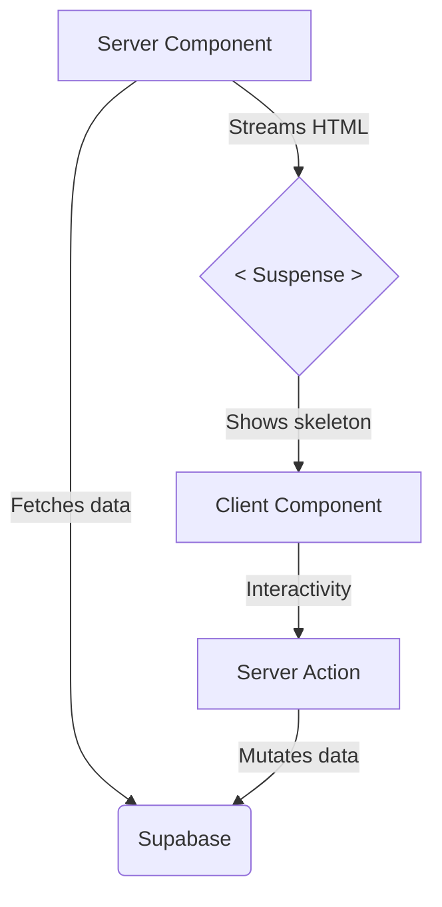

<div align="center">
  
  <h1>ChurrasKing</h1>
  <p>Organize churrascos, invite friends, and split costs — all in one link.</p>


</div>

---

## Table of Contents

- [Overview](#overview)
- [Features](#features)
- [Tech Stack](#tech-stack)
- [Architecture](#architecture)
- [Getting Started](#getting-started)
- [Project Structure](#project-structure)
- [Database Schema](#database-schema)
- [Security](#security)
- [Accessibility](#accessibility)
- [Testing](#testing)
- [Deployment](#deployment)
- [Roadmap](#roadmap)

---

## Overview

ChurrasKing is a full-stack web application for organizing brazilian barbecue (churrasco) events.
Hosts create an event and share a single link — guests open it, identify themselves with name and email, confirm attendance, and claim items to bring. No app download required.

> Built as a portifolio project demonstrating modern full-stack development with Next.js App Router,
> Supabase, TypeScript, and production-grade practices including i18n, PWA, accessibility, and security.

---

## Features

### Host

- Create and manage barbecue events
- Generate a shareable link per event
- Define items needed (food, drinks, supplies) with estimated costs
- View guest list with RSVP status in real time
- See cost summary and per-person breakdown

### Guest (no account required)

- Access event via shared link
- Confirm or decline attendance
- Claim items to bring
- See live updates as other guests respond

---

## Tech Stack

| Layer         | Technology                                       |
| ------------- | ------------------------------------------------ |
| Framework     | Next.js 16 (App Router, RSC, Server Actions)     |
| Language      | TypeScript 5                                     |
| Database      | Supabase (PostgreSQL + Row Level Security)       |
| Auth          | Supabase Auth (email/password + Google OAuth)    |
| Realtime      | Supabase Realtime                                |
| Styling       | Tailwind CSS v4 + shadcn/ui (Maia)               |
| Forms         | React Hook Form + Zod v4                         |
| Data Fetching | TanStack Query v5 (client-side cache + Realtime) |
| i18n          | next-intl (pt-BR + en)                           |
| PWA           | next-pwa + Workbox                               |
| Testing       | Vitest + Testing Library + Playwright            |
| Deployment    | Vercel                                           |

---

## Architecture

### App Router & Server Components

This project uses the Next.js App Router with React Server Components (RSC) as the default.
Data fetching happens on the server via `async/await` — no `useEffect`, no client fetches for initial data.
Client Components (`"use client"`) are used only where interactivity is required.



### Key architectural decisions

- **Server Actions over API Routes** — mutations go through `actions/*.ts` files, which run on the server with direct DB access. This replaces the controller/DTO pattern from traditional REST APIs.
- **RLS as the security layer** — Row Level Security policies on all Supabase tables enforce access control at the database level, not just the application layer.
- **Guest identity without auth** — guests are identified by a signed HMAC cookie containing their `guestId`, avoiding forced account creation while preventing impersonation.
- **TanStack Query for Realtime only** — all initial data uses RSC. TanStack Query manages the client cache invalidated by Supabase Realtime subscriptions.

---

## Getting Started

### Prerequisites

- Node.js 20+
- pnpm 9+
- Supabase account (free tier works)

### 1. Clone and install

```bash
git clone https://github.com/AdanPGomes/churrasking.git
cd churrasking
pnpm install
```

### 2. Set up environment variables

```bash
cp .env.local.example .env.local
```

Fill in the values in `.env.local`:

```bash
NEXT_PUBLIC_SUPABASE_URL=       # from Supabase project settings
NEXT_PUBLIC_SUPABASE_ANON_KEY=  # from Supabase project settings
SUPABASE_SERVICE_ROLE_KEY=      # server-side only, never expose to client
NEXT_PUBLIC_APP_URL=http://localhost:3000
GUEST_SESSION_SECRET=           # any random string, min 32 chars
```

### 3. Set up the database

```bash
# Install Supabase CLI if you haven't
pnpm dlx supabase login
pnpm dlx supabase db push
```

Or run the migration SQL manually in the Supabase dashboard SQL editor.

### 4. Run the development server

```bash
pnpm dev
```

Open [http://localhost:3000](http://localhost:3000)

---

## Project Structure

```
src/
├── app/
│   └── [locale]/
│       ├── (auth)/          # Login and register pages
│       └── (app)/           # Authenticated host pages
│           ├── dashboard/
│           └── events/
├── components/
│   ├── ui/                  # shadcn/ui primitives
│   ├── events/              # EventCard, EventForm
│   ├── guests/              # GuestList, GuestRow, RsvpButtons
│   ├── items/               # ItemsBoard, ItemRow, CostSummary
│   └── layout/              # Header, Footer, Skeleton loaders
├── actions/                 # Server Actions (mutations)
│   ├── events.ts
│   ├── guests.ts
│   └── items.ts
├── lib/
│   ├── supabase/            # Supabase client (server + client + middleware)
│   ├── validations/         # Zod schemas
│   └── utils/               # slug generation, cost calculation, helpers
├── hooks/                   # TanStack Query hooks (Realtime)
├── types/                   # Shared TypeScript types
└── messages/                # i18n strings
    ├── en.json
    └── pt.json
```

---

## Database Schema

```sql
profiles    -- extends Supabase auth.users
events      -- id, host_id, title, slug, date, location, cover_url
guests      -- id, event_id, name, email, rsvp_status
items       -- id, event_id, name, estimated_cost, assigned_guest_id
```

All tables have Row Level Security enabled. See `supabase/migrations/` for full schema and RLS policies.

---

## Security

This project addresses the [OWASP Top 10](https://owasp.org/www-project-top-ten/)

| #   | Risk                      | Mitigation                                        |
| --- | ------------------------- | ------------------------------------------------- |
| A01 | Broken Access Control     | RLS on all tables; `host_id` set server-side      |
| A02 | Cryptographic Failures    | Supabase Auth handles password hashing            |
| A03 | Injection                 | Zod validation + Supabase parameterized queries   |
| A04 | Insecure Design           | Guest cookie signed with HMAC-SHA256              |
| A05 | Security Misconfiguration | CSP, X-Frame-Options, Referrer-Policy headers     |
| A06 | Vulnerable Components     | `npm audit` in CI + Dependabot                    |
| A07 | Auth Failures             | Min 8-char password; Supabase rate limiting       |
| A08 | Software Integrity        | Dependabot + `npm audit --audit-level=high` in CI |
| A09 | Logging Failures          | Supabase logs + Vercel log drain                  |
| A10 | SSRF                      | Domain whitelist for user-supplied image URLs     |

---

## Accessibility

Targeting **WCAG 2.1 AA**

- Semantic HTML landmarks (`<main>`, `<nav>`, `<header>`)
- All interactive elements keyboard-navigable
- ARIA attributes on dynamic content (`aria-live`, `aria-pressed`, `aria-busy`)
- Color contrast ratio ≥ 4.5:1 for all text
- Status never communicated by color alone (icon + color + text)
- Focus trapped in modals and returned on close

---

### Testing

```bash
# Unit and integration tests
pnpm test

# With coverage report
pnpm test:coverage

# E2E tests (require running app)
pnpm test:e2e

# E2E with UI (debug mode)
pnpm test:e2e --ui
```

**Coverage targets:** ≥ 80% on `src/lib` and `src/actions/`

**E2E journeys covered:**

- Host: register → create event → add items → copy link
- Guest: open link → identify → RSVP → claim item → reload persisted
- Security: unauthenticated access redirects to login

---

## Deployment

Deployed on [Vercel](https://vercel.com) with automatic preview deployments on every push.

[](https://vercel.com/new/clone?repository-url=https://github.com/AdanPGomes/churrasking)

### Environment variables on Vercel

Add the same variables from `.env.local.example` in the Vercel dashboard under
**Settings → Environment Variables**. Set `NEXT_PUBLIC_APP_URL` to your production domain.

---

## Roadmap

- [ ] Phase 1: Core — auth, event creation, guest flow, shareable link
- [ ] Phase 2: Collaboration — items board, cost splitting, realtime
- [ ] Phase 3: Polish — i18n, PWA, SEO, animations, E2E tests

---

## Appendix

### Naming Conventions

| Context            | Convention              | Example                      |
| ------------------ | ----------------------- | ---------------------------- |
| Files/folders      | `kebab-case`            | `event-card.tsx`             |
| Components         | `PascalCase`            | `EventCard`                  |
| Functions / hooks  | `camelCase`             | `useEventRealtime`           |
| Server Actions     | `camelCase` verb + noun | `createEvent`, `upsertGuest` |
| Zod schemas        | `camelCase` + `Schema`  | `createEventSchema`          |
| Types / interfaces | `PascalCase`            | `Guest`, `RsvpStatus`        |
| Constants          | `SCREAMING_SNAKE_CASE`  | `MAX_ITEMS_PER_EVENT`        |
| DB tables          | `snake_case` plural     | `events`, `guests`, `items`  |
| DB columns         | `snake_case`            | `host_id`, `rsvp_status`     |
| Env variables      | `SCREAMING_SNAKE_CASE`  | `NEXT_PUBLIC_SUPABASE_URL`   |

---

### Environment Variables

```bash
# Supabase
NEXT_PUBLIC_SUPABASE_URL=
NEXT_PUBLIC_SUPABASE_ANON_KEY=
SUPABASE_SERVICE_ROLE_KEY=      # server-side only, never exposed to client

# App
NEXT_PUBLIC_APP_URL=            # used for shareable link generation
GUEST_SESSION_SECRET=           # HMAC secret for guest cookie signing (min 32 chars)

# Optional
NEXT_PUBLIC_GA_ID=              # Google Analytics
```

---

<div align="center">
  Made with 🔥 by <a href="https://github.com/AdanPGomes">Adan Gomes</a>
</div>
